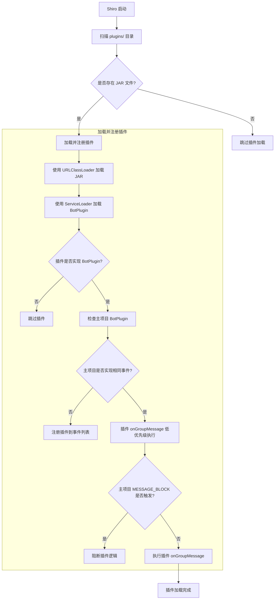

# 快速开始

## 基础信息

::: tip 提示

- 本文档默认您了解并熟悉 `Java/Kotlin` 基本语法以及 `SpringBoot` 开发体系
- QQ 群：`174706945`
  :::

::: warning 注意

- `v2` 版本开始仅支持 `JDK 17+` 与 `SpringBoot 3.0.0+`
- 客户端需要支持 `websocket reverse` 即反向 `websocket` 连接
- 支持 `Onebot V11` 标准及 `go-cqhttp` 拓展
  :::

## 项目创建

1. 首先创建一个空的 `SpringBoot` 项目（什么？不会？可以右上角关闭本页面了）
2. [引入依赖](#依赖引入)
3. [服务端配置](#服务端配置)
4. [客户端配置](#客户端配置)
5. [编写插件](#第一个插件)

## 依赖引入

<a href="https://search.maven.org/search?q=com.mikuac.shiro"></a>

::: warning 注意
引入依赖时请替换版本 `latest` 为 `Maven Central` 实际的最新版本
:::

### Maven

```xml
<dependency>
  <groupId>com.mikuac</groupId>
  <artifactId>shiro</artifactId>
  <version>latest</version>
</dependency>
```

### Gradle Kotlin DSL

```kotlin
implementation("com.mikuac:shiro:latest")
```

### Gradle Groovy DSL

```groovy
implementation 'com.mikuac:shiro:latest'
```

## 连接配置

`SpringBoot` 项目默认的配置文件路径应为 `resources/application.prorperties`，推荐变更为 `yaml` 格式的配置文件，以提供一个较为良好的编写与阅读体验

::: tip 提示
以下配置文件为最小实例

更多配置项见 [进阶配置](advanced.html#进阶配置文件)
:::

```yaml
# 该配置为反向连接示例
server:
  port: 5555

shiro:
  ws:
    server:
      enable: true
      url: "/ws/shiro"
```

```yaml
# 该配置为正向连接示例
shiro:
  ws:
    client:
        enable: true
        url: "ws://websocket_server:port"
```

## 实例端配置

::: tip 提示
实例端配置文件使用 `go-cqhttp` 为例，配置反向 `websocket` 连接服务端
:::

```yaml
# 连接服务列表
servers:
  # 反向WS设置
  - ws-reverse:
      # 反向WS Universal 地址
      # 注意 设置了此项地址后下面两项将会被忽略
      universal: ws://127.0.0.1:5555/ws/shiro
      # 反向WS API 地址
      api: ws://your_websocket_api.server
      # 反向WS Event 地址
      event: ws://your_websocket_event.server
      # 重连间隔 单位毫秒
      reconnect-interval: 3000
      middlewares:
        <<: *default # 引用默认中间件
```

## 第一个插件

### 注解事件

```java
@Shiro
@Component
public class ExamplePlugin {
    // 更多用法详见 @MessageHandlerFilter 注解源码

    // 当机器人收到的私聊消息消息符合 cmd 值 "hi" 时，这个方法会被调用。
    @PrivateMessageHandler
    @MessageHandlerFilter(cmd = "hi")
    public void fun1(Bot bot, PrivateMessageEvent event, Matcher matcher) {
        // 构建消息
        String sendMsg = MsgUtils.builder().face(66).text("Hello, this is shiro demo.").build();
        // 发送私聊消息
        bot.sendPrivateMsg(event.getUserId(), sendMsg, false);
    }

    // 如果 at 参数设定为 AtEnum.NEED 则只有 at 了机器人的消息会被响应
    @GroupMessageHandler
    @MessageHandlerFilter(at = AtEnum.NEED)
    public void fun2(GroupMessageEvent event) {
        // 以注解方式调用可以根据自己的需要来为方法设定参数
        // 例如群组消息可以传递 GroupMessageEvent, Bot, Matcher 多余的参数会被设定为 null
        System.out.println(event.getMessage());
    }

    // 同时监听群组及私聊消息 并根据消息类型（私聊，群聊）回复
    @AnyMessageHandler
    @MessageHandlerFilter(cmd = "say hello")
    public void fun3(Bot bot, AnyMessageEvent event) {
        bot.sendMsg(event, "hello", false);
    }
}
```

### 重写事件

::: tip 提示

- 注解方式编写的插件无需在插件列表（plugin-list）定义
- 服务端配置文件 `resources/application.yaml` 追加如下内容
- 插件列表为顺序执行，如果前一个插件返回了 `MESSAGE_BLOCK` 将不会执行后续插件
  :::

```yaml
shiro:
  plugin-list:
    - com.example.bot.plugins.ExamplePlugin
```

```java
@Component
public class ExamplePlugin extends BotPlugin {

    @Override
    public int onPrivateMessage(Bot bot, PrivateMessageEvent event) {
        if ("hi".equals(event.getMessage())) {
            // 构建消息
            String sendMsg = MsgUtils.builder()
                    .face(66)
                    .text("hello, this is shiro example plugin.")
                    .build();
            // 发送私聊消息
            bot.sendPrivateMsg(event.getUserId(), sendMsg, false);
        }
        // 返回 MESSAGE_IGNORE 执行 plugin-list 下一个插件，返回 MESSAGE_BLOCK 则不执行下一个插件
        return MESSAGE_IGNORE;
    }

    @Override
    public int onGroupMessage(Bot bot, GroupMessageEvent event) {
        if ("hi".equals(event.getMessage())) {
            // 构建消息
            String sendMsg = MsgUtils.builder()
                    .at(event.getUserId())
                    .face(66)
                    .text("hello, this is shiro example plugin.")
                    .build();
            // 发送群消息
            bot.sendGroupMsg(event.getGroupId(), sendMsg, false);
        }
        // 返回 MESSAGE_IGNORE 执行 plugin-list 下一个插件，返回 MESSAGE_BLOCK 则不执行下一个插件
        return MESSAGE_IGNORE;
    }

}
```

### 加载外部插件

#### 工作流程

::: tip 提示
由于本文档系统不支持 mermaid 渲染，详见 Github README
:::

<details>
  <summary>点击展开/折叠 Shiro 插件加载流程图</summary>


</details>

#### 目录结构
`Shiro` 支持自动加载 `.jar` 格式的插件，并通过 `ServiceLoader` 进行管理。默认情况下，`Shiro` 会扫描当前运行路径下的 `plugins` 目录，并尝试加载所有符合 `BotPlugin` 接口的插件。

以下只是一个示例结构（可根据实际情况调整，比如替换 Gradle 为 Maven）
```
ForeignPluginExample/
├── src/                                                                  # 源代码目录
│   ├── main/java/com/mikuac/demo/DemoPlugin.java                         # 插件实现
│   ├── main/resources/META-INF/services/com.mikuac.shiro.core.BotPlugin  # SPI 注册文件
├── build.gradle.kts            # Gradle 构建脚本
├── settings.gradle.kts         # Gradle 设置文件
├── gradlew                     # Gradle 可执行文件（Linux/macOS）
├── gradlew.bat                 # Gradle 可执行文件（Windows）
└── gradle/wrapper/             # Gradle Wrapper 相关文件
```

#### 开发指南

##### 插件类定义

插件必须实现 `BotPlugin` 接口，并使用 `@Component` 注解，以便 `Shiro` 能够正确识别。

```java
package com.mikuac.demo;

import com.mikuac.shiro.core.Bot;
import com.mikuac.shiro.core.BotPlugin;
import com.mikuac.shiro.dto.event.message.GroupMessageEvent;
import org.springframework.stereotype.Component;

@Component
public class DemoPlugin extends BotPlugin {
    @Override
    public int onGroupMessage(Bot bot, GroupMessageEvent event) {
        String msg = event.getMessage();
        if (msg.equals("ping")) {
            bot.sendGroupMsg(event.getGroupId(), "pong", false);
            return MESSAGE_BLOCK;
        }
        return MESSAGE_IGNORE;
    }
}
```
##### 配置 META-INF/services

为了让 `ServiceLoader` 能够发现插件，需要在 `src/main/resources/META-INF/services/` 目录下创建 `com.mikuac.shiro.core.BotPlugin` 文件，并填写插件的完整类名。

```
com.mikuac.demo.DemoPlugin
```

##### 配置构建脚本

在 `build.gradle.kts` 中添加以下配置，用于正确处理插件打包和依赖管理：

```kotlin
tasks.withType<Jar> {
    // 处理JAR中的重复文件，INCLUDE策略表示保留所有重复项
    duplicatesStrategy = DuplicatesStrategy.INCLUDE

    // 将主源集的所有编译输出加入JAR包
    from(sourceSets.main.get().output)

    manifest {
        // 添加基本信息到 MANIFEST.MF
        attributes(
            mapOf(
                "Implementation-Title" to project.name,       // 使用项目名称
                "Implementation-Version" to project.version,  // 添加版本信息
                "Built-By" to System.getProperty("user.name"),
                "Created-By" to "Gradle ${gradle.gradleVersion}"
            )
        )
        
        // 生成并添加依赖清单
        val dependenciesString = configurations
            .getByName("runtimeClasspath")  // 获取运行时实际解析的依赖
            .resolvedConfiguration
            .resolvedArtifacts
            .map {
                // 将依赖格式化为 "groupId:artifactId:version" 格式
                "${it.moduleVersion.id.group}:${it.moduleVersion.id.name}:${it.moduleVersion.id.version}"
            }
            .distinct()  // 移除重复项
            .filterNot { coordinates ->
                // 过滤掉不应由插件加载的依赖
                // 这些依赖应当由 Shiro 主程序提供，避免类加载冲突
                coordinates.startsWith("org.springframework") ||  // Spring框架
                coordinates.startsWith("com.mikuac:shiro") ||     // Shiro
                coordinates.startsWith("org.slf4j") ||            // 日志门面
                coordinates.startsWith("ch.qos.logback")          // 日志实现
            }
            .joinToString(", ")  // 使用逗号分隔依赖列表

        // 添加依赖列表到 manifest 中，Shiro 将解析此属性来下载所需依赖
        attributes(mapOf("Dependencies" to dependenciesString))
    }
}

// 可选：配置依赖项
dependencies {
    // Shiro 本身仅在编译时需要，运行时由主程序提供
    compileOnly("com.mikuac:shiro:latest")
    
    // 添加其他依赖，这些将被包含在Dependencies清单中
    implementation("com.example:some-library:1.0.0")
}
```

##### 编译插件

```
./gradlew build
```

生成的插件 `JAR` 文件位于 `build/libs/DemoPlugin-1.0-SNAPSHOT.jar`，需要将其移动到 `Shiro` 的 `plugins` 目录中。

##### 重新启动 Shiro 以加载插件

`Shiro` 在启动时会自动扫描 `plugins` 目录，并加载符合条件的插件。

##### 相关配置
`Shiro` 的 `application.yml` 中可以自定义插件目录:

```yaml
shiro:
  pluginScanPath: "/home/user/mybot"
```
这样，`Shiro` 将从 `/home/user/mybot` 目录加载插件，而不是默认的 `plugins`。